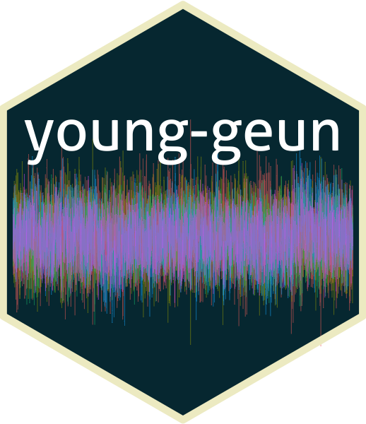

```{r setup, include=FALSE}
knitr::opts_chunk$set(
  comment = "#>",
  collapse = TRUE,
  out.width = "70%",
  fig.align = "center",
  fig.width = 6,
  fig.asp = .618,
  echo = FALSE
  )
options(digits = 3)
options(knitr.kable.NA = "")
options(kableExtra.latex.load_packages = FALSE)
is_html <- knitr::opts_knit$get("rmarkdown.pandoc.to") == "html"
is_latex <- knitr::opts_knit$get("rmarkdown.pandoc.to") == "latex"
kable_format <- ifelse(!is_html, "latex", "html")
kable_format <- ifelse(length(kable_format) == 0, "html", kable_format) # for excecutable
```

```{r pkgs, message=FALSE}
# tidyverse family---------------------
library(tidyverse)
# large data---------------------------
library(data.table)
# kable--------------------------------
library(knitr)
library(kableExtra)
# multivariate FARIMA------------------
library(multiwave)
# tidyverts----------------------------
library(tsibble)
library(feasts)
library(forecast)
# animate------------------------------
# library(gganimate)
# set seed for report -----------------
set.seed(1)
```

## Hi there , I'm [Young Geun Kim](https://ygeunkim.github.io) <a href='https://github.com/ygeunkim'></a>

Thanks for visiting my page:


[](https://github.com/ygeunkim)

### I'm a Graduate student researcher

- 🧑🏼‍🎓 B.E. in Statistics, **[Sungkyunkwan University (SKKU)](https://www.skku.edu/eng/)**
- `r emo::ji("telescope")` I’m a graduate student at **[department of statistics, SKKU](https://stat.skku.edu/stat/index.do)**
<!-- - `r emo::ji("seedling")` I’m currently learning **Statistics** -->
- `r emo::ji("thinking")` I’m interested in **time series**, especially
    - long-range dependency, and
    - high dimensional time series

```{r mfarima, include=FALSE}
# cov_matrix---------------------------------------
# ndim=2 means creating block matrix replication S1 ndim times
ndim <- 1
S1 <- diag(20)
S1[1, 6] <- S1[6, 1] <- .7
S1[11, 14] <- S1[14, 11] <- .5
S1[20, 3] <- S1[3, 20] <- .4
S1 <- kronecker(diag(ndim), S1)
# Generate function - n * p LRD data
generate_lrd <- function(n = 200, p = 20, cov_matrix = S1, burn = 2000) {
  # LRD parameters-----------------------------------
  d <- runif(p, .1, .45)
  d <- floor(100 * d) / 100
  fivarma(
    N = n, d = d, cov_matrix = solve(cov_matrix),
    VAR = NULL, VMA = NULL,
    skip = burn
  )$x
}
# Generate-------------------------------------------
lrd_data <- as.data.table(generate_lrd(n = 15000))
```

```{r lrdmulti, fig.cap="LRD Time Series"}
lrd_data %>% 
  mutate(id = 1:n()) %>% 
  pivot_longer(-id, names_to = "name", values_to = "value") %>% 
  ggplot(aes(x = id)) +
  geom_path(aes(y = value, colour = name), alpha = .5, show.legend = FALSE) +
  theme_minimal() +
  theme(axis.title = element_blank())
```

- e.g. Realized volatility data from [https://realized.oxford-man.ox.ac.uk](https://realized.oxford-man.ox.ac.uk/data/assets):
    - Modeling and forecasting
    - Based on vector autoregression

```{r}
rk <- 
  fread("data/oxfordmanrealizedvolatilityindices.csv") %>% 
  .[, .SD, .SDcols = c("V1", "Symbol", "rv5")]
setnames(rk, c("V1", "Symbol"), c("Date", "Index"))
rk <- 
  rk %>% 
  as_tsibble(key = Index, index = Date)
```

```{r rvplot, fig.cap="Realized Volatility of Financial Indices", fig.asp = 1}
rk %>% 
  filter_index("2015" ~ "2019") %>% 
  autoplot(rv5, alpha = .6) +
  theme_minimal() +
  theme(
    legend.position = "bottom"
  ) +
  scale_color_viridis_d(option = "A") +
  labs(
    y = "5-min Realized Variance"
  )
```


---

### Technical skills


### 🧑🏼‍💻 I spent my time in github...

<!-- [](https://github.com/anuraghazra/github-readme-stats) -->
<!--  -->
<!-- [](https://github.com/anuraghazra/github-readme-stats) -->

<details>
  <summary>💯 My Activities</summary>
    <br/>
      <a href="https://github.com/anuraghazra/github-readme-stats"></a>
      <a href="https://github.com/anuraghazra/github-readme-stats"></a>
    <br/>
</details>

<!-- <br/> -->
<!--     <a href="https://github.com/anuraghazra/github-readme-stats"></a> -->
<!--   <a href="https://github.com/anuraghazra/github-readme-stats"></a> -->
<!-- <br/> -->

<!-- [](https://github.com/ashutosh00710/github-readme-activity-graph) -->

<details>
  <summary>📈 Contribution Timeline</summary>
    <a href="https://github.com/ashutosh00710/github-readme-activity-graph"></a>
</details>

