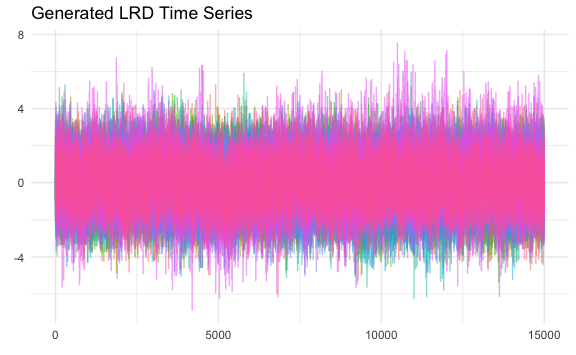
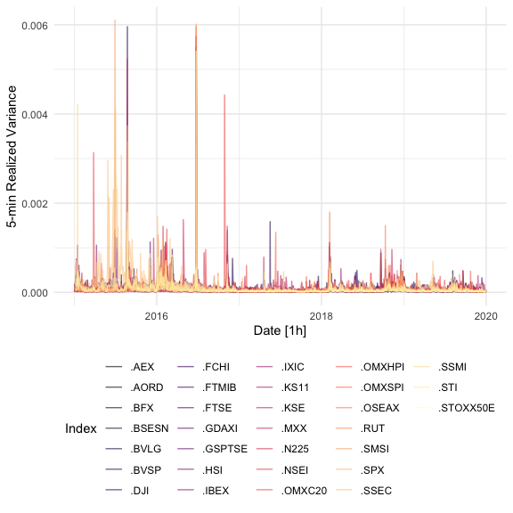

## Hi there , I’m [Young Geun Kim](https://ygeunkim.github.io) 

Thanks for visiting my page:

<!-- badges: start -->

<!-- badges: end -->

### I’m a Statistics student researcher

<ul>
<li>
🧑🏼‍🎓 BEc in Statistics,
<a href="https://www.skku.edu/eng/"><strong>Sungkyunkwan University
(SKKU)</strong></a>
</li>
<li>
🔭 I’m a Ph.D. Candidate in
<a href="https://stat.skku.edu/stat/index.do"><strong>department of
statistics, SKKU</strong></a>
</li>
<li>
🤔 I’m interested in <strong>time series</strong>, especially
</li>
<ul>
<li>

Long-range dependency,

</li>
<li>

Vector autoregression,

<ul>
<li>
Modeling and forecasting
</li>
</ul>
<ul>
<li>
High dimensional time series
</li>
</ul>
<ul>
<li>
Heterogeneous autoregression (HAR)
</li>
</ul>

</li>
<li>

Bayesian econometrics,

<ul>
<li>
Bayesian VAR modeling
</li>
</ul>
<ul>
<li>
Nowcasting
</li>
</ul>

</li>
<li>
and Anomaly detection
</li>
</ul>
</ul>

### 🧑🏼‍💻 I spent my time in github…

### Recent publications

- [Residual Size is Not Enough for Anomaly Detection: Improving
  Detection Performance using Residual Similarity in Multivariate Time
  Series](https://ygeunkim.github.io/publication/nndsac/)
- [Revitalizing Self-Organizing Map: Anomaly Detection using Forecasting
  Error Patterns](https://ygeunkim.github.io/publication/somifip/)
- [Contextual Anomaly Detection by Correlated Probability Distributions
  using Kullback-Leibler
  Divergence](https://ygeunkim.github.io/publication/kl_poster/)
