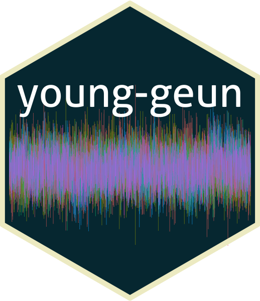

## Hi there 👋🏼 I’m [Young Geun Kim](https://ygeunkim.github.io) 

Thanks for visiting my page:

<!-- badges: start -->

<!-- badges: end -->

### I’m...

<ul>
<li>

🧑🏼‍🎓 Ph.D. in Statistics,
<a href="https://www.skku.edu/eng/"><strong>Sungkyunkwan University
(SKKU)</strong></a>

<ul>
<li>
Dissertation title: <em> Bayesian Modeling and Forecasting of High Dimensional Long Range Dependent Time Series </em>
</li>
<li>
Advisor: <a href="https://sites.google.com/view/crbaek">Changryong Baek</a>
</li>
</ul>

</li>
<li>
🧑🏼‍🎓 BEc in
<a href="https://stat.skku.edu/stat/index.do"><strong>Statistics, SKKU</strong></a>
</li>
<li>
🤔 I’m interested in <strong>time series</strong>, especially
</li>
<ul>
<li>
High-dimensional time series analysis/forecasting,
</li>
<li>

Long-range dependency,

<ul>
<li>
Vector heterogeneous autoregressive (VHAR) model
</li>
</ul>

</li>
<li>

Bayesian econometrics,

<ul>
<li>
Bayesian VAR/VHAR
</li>
</ul>

</li>
<li>
and Anomaly detection
</li>
</ul>
</ul>

### 🧑🏼‍💻 I spent my time in github…

### ✍🏻 My research works

<table>
  <!-- JOURNAL:START --><tr><td><li><a href=https://ygeunkim.github.io/publication/bvhar/>Bayesian Vector Heterogeneous Autoregressive Modeling</a></li></td><td></td></tr><!-- JOURNAL:END -->
  
  <!-- CONF:START --><tr><td><li><a href=https://ygeunkim.github.io/publication/nndsac/>Residual Size is Not Enough for Anomaly Detection: Improving Detection Performance using Residual Similarity in Multivariate Time Series</a></li></td><td></td></tr><tr><td><li><a href=https://ygeunkim.github.io/publication/somifip/>Revitalizing Self-Organizing Map: Anomaly Detection using Forecasting Error Patterns</a></li></td><td></td></tr><!-- CONF:END -->
  
  <!-- POSTER:START -->
  <!-- POSTER:END -->
  
  <!-- PATENT:START -->
  <!-- PATENT:END -->
</table>
