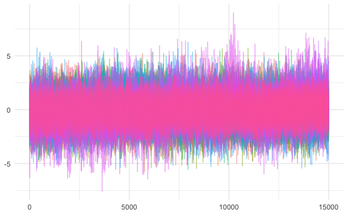

## Hi there , I’m [Young Geun Kim](https://ygeunkim.github.io) 

Thanks for visiting my page:

### I’m a Graduate student researcher

-   🧑🏼‍🎓 B.E. in Statistics, **[Sungkyunkwan University
    (SKKU)](https://www.skku.edu/eng/)**
-   🔭 I’m a graduate student at **[department of statistics,
    SKKU](https://stat.skku.edu/stat/index.do)**
    <!-- - 🌱 I’m currently learning **Statistics** -->
-   🤔 I’m interested in **time series**, especially
    -   long-range dependency, and
    -   high dimensional time series

Figure 1: LRD Time Series

-   e.g. Realized volatility data from
    [https://realized.oxford-man.ox.ac.uk](https://realized.oxford-man.ox.ac.uk/data/assets):
    -   Modeling and forecasting
    -   Based on vector autoregression

Figure 2: Realized Volatility of Financial Indices

------------------------------------------------------------------------

### Technical skills

### 🧑🏼‍💻 I spent my time in github…

<!--  -->
<!--  -->
<!--  -->

💯 My Activities

 

 

<!--   -->
<!--      -->
<!--    -->
<!--   -->
<!--  -->

📈 Contribution Timeline

