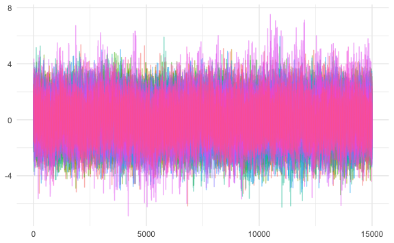

## Hi there , I’m [Young Geun Kim](https://ygeunkim.github.io) 

Thanks for visiting my page:

### I’m a Graduate student researcher

-   🧑🏼‍🎓 B.E. in Statistics, **[Sungkyunkwan University
    (SKKU)](https://www.skku.edu/eng/)**
-   🔭 I’m a graduate student at **[department of statistics,
    SKKU](https://stat.skku.edu/stat/index.do)**
-   🤔 I’m interested in **time series**, especially
    -   long-range dependency, and
    -   high dimensional time series

<ul>
<ul>
<li>

e.g. generated LRD figure

</li>
</ul>
</ul>

-   e.g. Realized volatility data from
    [https://realized.oxford-man.ox.ac.uk](https://realized.oxford-man.ox.ac.uk/data/assets):
    -   Modeling and forecasting
    -   Based on vector autoregression

<ul>
<ul>
<li>

See the realized volatility of financial assets figure

</li>
</ul>
</ul>

------------------------------------------------------------------------

### 🧑🏼‍💻 I spent my time in github…

💯 My Activities

 

 

------------------------------------------------------------------------

### Recent Publications

<!-- BLOG-POST-LIST:START -->
<!-- BLOG-POST-LIST:END -->
